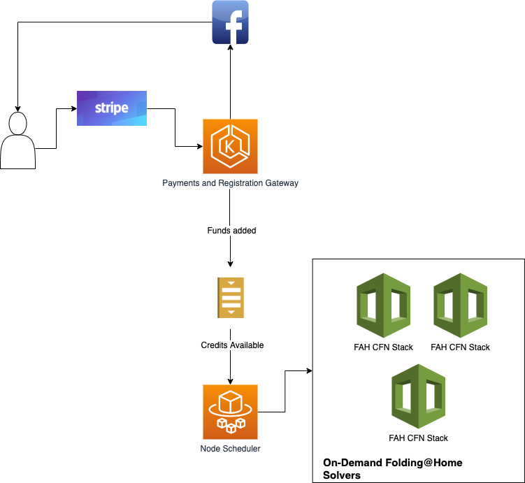

# Folding@Together

Democratizing folding@home (and potentially other networks like rosetta@home)

## Purpose

Though it isn't new, the Folding@Home project allows individuals to donate their computing resources to researchers searching for cures to diseases (like - and including - [COVID-19](https://foldingathome.org/covid19/)). These resources allow researchers to run computationally expensive simulations that illustrate how atoms in a protein move relative to each other, allowing for therapeutic discoveries.

However, there are two big issues preventing more people from helping:

1. Recognition. Many just don't know this software exists.
2. Fear. Downloading software can be daunting and scary. Downloading software that is "stealing" your computation resources is scarier.

### What Folding Together Does

In order to overcome the hurdles of (1) and (2), we democratize folding by allowing anyone to participate via micro-donations. These donations are then used to purchase computation resources on the cloud on the individuals' behalf. To incentivize future donations, we integrate with Facebook to allow the user to share their contribution.

## Technical



## High Level Tasks

1. Implementing the backing infrastructure into which computation resources will be provisioned
2. Scheduler to map user contributions to compute resource allocation
3. Registration and payments interface
4. Social recognition and feedback

## Development

### Running Frontend (Registration and Payments)

_Prerequisites_ - in order to run the frontend app, you'll need Docker installed and the gulp-cli available on the system path.

```bash
docker-compose up -d
gulp dev
```

## Running Deployments

### Deploying Frontend (Registration and Payments)

_Prerequisites_ - In order to deploy, make sure you have [helm](https://helm.sh/) installed and are set up in the AWS Auth configmap to authenticate with the cluster.

```bash
# register docker client
$(aws ecr get-login --no-include-email --region us-east-1)

# update version, build, and upload
VERSION=$(cat VERSION)
npm run build
docker build -t frontend-payments-registration:$VERSION .
docker tag frontend-payments-registration:$VERSION 451298871710.dkr.ecr.us-east-1.amazonaws.com/prod/frontend-payments-registration:$VERSION
docker push 451298871710.dkr.ecr.us-east-1.amazonaws.com/prod/frontend-payments-registration:$VERSION

# upgrade the release
helm upgrade --install frontend-registration-payments helm/frontend-registration-payments --set image.tag=$VERSION
```

### Deploying Folding@Home Single-Instance CFN Stack

```bash
aws cloudformation create-stack \
	--template-url https://s3.amazonaws.com/folding-together-artifacts/cloudformation/foldingathome.yaml \
	--stack-name folding-together-test \
	--parameters ParameterKey=KeyName,ParameterValue=folding_nodes ParameterKey=Subnets,ParameterValue='subnet-2ec0fc10 subnet-75ba187b subnet-8ba048ed subnet-b868d0f5 subnet-c007f0e1 subnet-ec3ecbb3' ParameterKey=VpcId,ParameterValue=vpc-394e4a43 \
	--capabilities CAPABILITY_IAM
```
